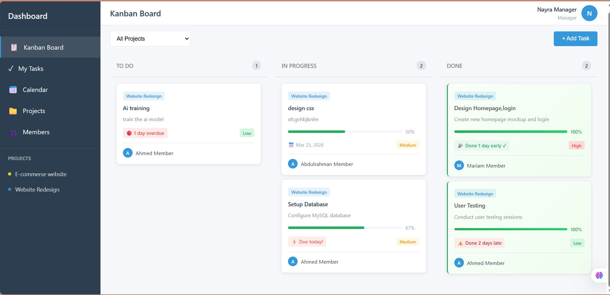
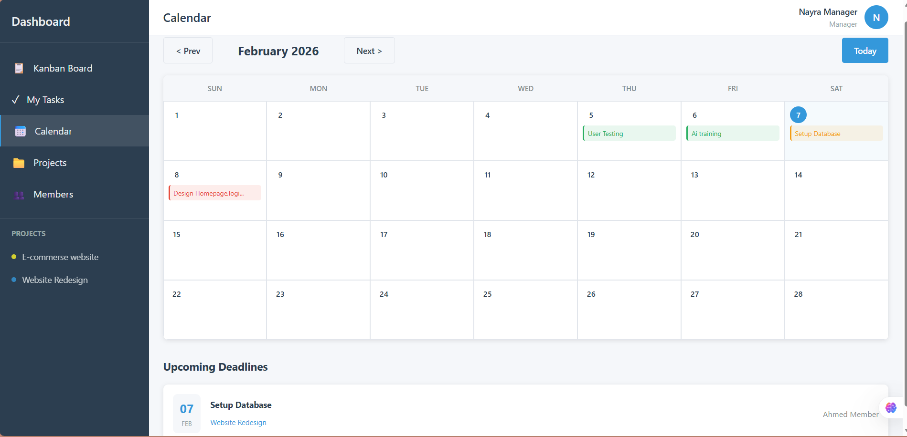
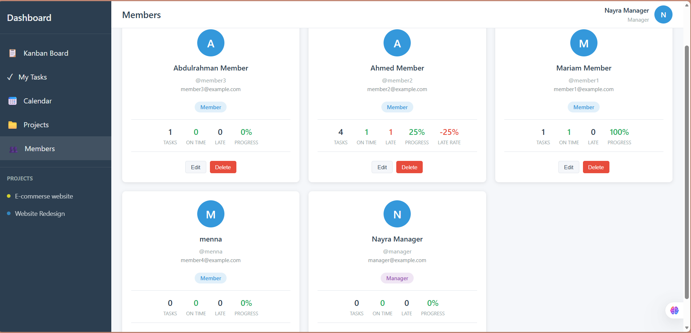

# 📋 Project Dashboard

A full-featured **Project Management Dashboard** built with PHP, MySQL, and vanilla JavaScript. Manage projects, tasks, and team members with an intuitive Kanban board, calendar view, and role-based access control.


---

## ✨ Features

### 🗂️ Kanban Board
- Drag-and-drop task management across **To Do**, **In Progress**, and **Done** columns
- Filter tasks by project
- Real-time task count per column

### ✅ Task Management
- Create, edit, and delete tasks with detailed information
- Assign tasks to team members
- Set priorities (Low, Medium, High)
- Due date tracking with overdue indicators
- **Subtasks** — break tasks into smaller actionable items
- **Comments** — collaborate with team members on tasks
- **File Attachments** — upload and manage files per task

### 📅 Calendar View
- Visualize tasks on an interactive calendar
- View upcoming deadlines at a glance

### 📁 Project Management *(Manager only)*
- Create and manage projects with custom color labels
- Automatic project archival when all tasks are completed
- Track project-level file attachments

### 👥 Team Members *(Manager only)*
- View all team members and their roles
- Track task statistics per member (total, completed, on-time, late)
- Add, edit, and manage user accounts

### 🔐 Authentication & Authorization
- Secure login system with session management
- **Role-based access control**:
  - **Manager** — Full access: create tasks, manage projects, manage members
  - **Member** — Can view and update assigned tasks

---

## 🛠️ Tech Stack

| Layer       | Technology                          |
|-------------|-------------------------------------|
| **Backend** | PHP 8.x                            |
| **Database**| MySQL (MySQLi)                     |
| **Frontend**| HTML5, CSS3, Vanilla JavaScript    |
| **Server**  | Apache (XAMPP)                     |

---

## 📁 Project Structure

```
project-dashboard/
├── api/                    # REST API endpoints
│   ├── comments.php        # Task comments CRUD
│   ├── files.php           # File upload/download/delete
│   ├── projects.php        # Project CRUD
│   ├── subtasks.php        # Subtask management
│   ├── tasks.php           # Task CRUD & status updates
│   └── users.php           # User management & stats
├── assets/
│   ├── css/
│   │   └── style.css       # Complete application styles
│   └── js/
│       ├── app.js          # Shared utilities
│       ├── calendar.js     # Calendar view logic
│       ├── kanban.js       # Kanban board logic
│       ├── members.js      # Members page logic
│       ├── my-tasks.js     # My Tasks page logic
│       └── projects.js     # Projects page logic
├── config/
│   └── database.php        # Database configuration
├── includes/
│   ├── footer.php          # Page footer
│   ├── functions.php       # Helper functions & utilities
│   ├── header.php          # Page header & sidebar navigation
│   ├── task-card.php       # Task card component
│   └── template.php        # Template utilities
├── templates/
│   ├── login.html          # Login page template
│   ├── modals/
│   │   ├── project-modal.php
│   │   └── task-modal.php
│   └── views/
│       ├── calendar.html
│       ├── kanban.html
│       ├── members.html
│       ├── my-tasks.html
│       └── projects.html
├── uploads/                # Uploaded file storage
├── index.php               # Kanban Board (main page)
├── calendar.php            # Calendar view
├── login.php               # Authentication
├── logout.php              # Session logout
├── members.php             # Team members (manager only)
├── my-tasks.php            # Personal task list
└── projects.php            # Project management (manager only)
```

---

## 🚀 Getting Started

### Prerequisites

- [XAMPP](https://www.apachefriends.org/) (or any Apache + PHP + MySQL stack)
- PHP 8.0 or higher
- MySQL 5.7 or higher

### Installation

1. **Clone the repository**

   ```bash
   git clone https://github.com/yourusername/project-dashboard.git
   ```

2. **Move to your web server directory**

   ```bash
   # For XAMPP on Windows
   mv project-dashboard C:/xampp/htdocs/project-dashboard

   # For XAMPP on macOS/Linux
   mv project-dashboard /opt/lampp/htdocs/project-dashboard
   ```

3. **Create the database**

   Open phpMyAdmin (`http://localhost/phpmyadmin`) and create a new database:

   ```sql
   CREATE DATABASE project_dashboard;
   ```

4. **Import the database schema**

   Import the provided SQL file via phpMyAdmin, or run:

   ```bash
   mysql -u root -p project_dashboard < database.sql
   ```

5. **Configure database connection**

   Edit `config/database.php` if your MySQL credentials differ from the defaults:

   ```php
   define('DB_HOST', 'localhost');
   define('DB_USER', 'root');
   define('DB_PASS', '');
   define('DB_NAME', 'project_dashboard');
   ```

6. **Set upload directory permissions**

   ```bash
   chmod 755 uploads/
   ```

7. **Start Apache & MySQL** via the XAMPP Control Panel

8. **Open in browser**

   ```
   http://localhost/project-dashboard
   ```

---

## 📸 Screenshots


| Kanban Board | Calendar View | Members |
|:---:|:---:|:---:|
|  |  |  |

---

## 🔑 Default Credentials

| Role    | Username | Password |
|---------|----------|----------|
| Manager | `admin`  | `admin`  |
| Member  | `user`   | `user`   |

> ⚠️ **Important:** Change default passwords before deploying to production.

---

## 📡 API Endpoints

| Endpoint             | Actions                                      |
|----------------------|----------------------------------------------|
| `api/tasks.php`      | `create`, `update`, `delete`, `list`, `get`  |
| `api/projects.php`   | `create`, `update`, `delete`, `list`         |
| `api/comments.php`   | `add`, `get`, `delete`                       |
| `api/subtasks.php`   | `add`, `toggle`, `delete`                    |
| `api/files.php`      | `upload`, `get`, `delete`                    |
| `api/users.php`      | `list`, `list_stats`, `get`, `create`, `update`, `delete` |

All API endpoints return JSON responses and require authentication via session.

---

## 🔒 Security Features

- **Prepared Statements** — All database queries use parameterized queries to prevent SQL injection
- **Input Sanitization** — User inputs are sanitized with `htmlspecialchars()` to prevent XSS
- **Session-based Authentication** — Secure session management for user login
- **Role-based Access Control** — Manager and Member roles with restricted permissions
- **File Upload Validation** — Secure file handling with unique filename generation

---

## 🤝 Contributing

Contributions are welcome! Please follow these steps:

1. Fork the repository
2. Create a feature branch (`git checkout -b feature/amazing-feature`)
3. Commit your changes (`git commit -m 'Add amazing feature'`)
4. Push to the branch (`git push origin feature/amazing-feature`)
5. Open a Pull Request

---

## 🎓 About

This project was developed as a university coursework project for the **Web Programming** course — **2nd Year, 1st Semester**.

---

<p align="center">Made with ❤️ using PHP, MySQL & JavaScript</p>


